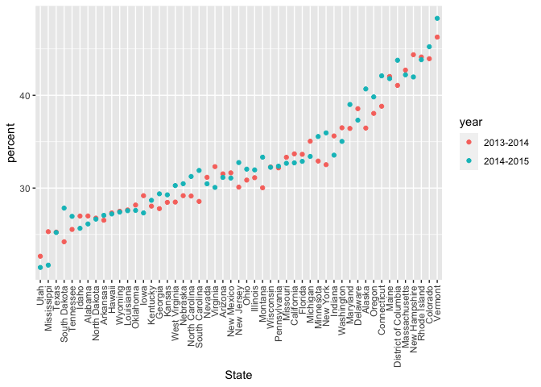

Strings and Factors
================

``` r
library(tidyverse)
```

    ## ── Attaching core tidyverse packages ──────────────────────── tidyverse 2.0.0 ──
    ## ✔ dplyr     1.1.3     ✔ readr     2.1.4
    ## ✔ forcats   1.0.0     ✔ stringr   1.5.0
    ## ✔ ggplot2   3.4.3     ✔ tibble    3.2.1
    ## ✔ lubridate 1.9.2     ✔ tidyr     1.3.0
    ## ✔ purrr     1.0.2     
    ## ── Conflicts ────────────────────────────────────────── tidyverse_conflicts() ──
    ## ✖ dplyr::filter() masks stats::filter()
    ## ✖ dplyr::lag()    masks stats::lag()
    ## ℹ Use the conflicted package (<http://conflicted.r-lib.org/>) to force all conflicts to become errors

``` r
library(rvest)
```

    ## 
    ## Attaching package: 'rvest'
    ## 
    ## The following object is masked from 'package:readr':
    ## 
    ##     guess_encoding

``` r
library(p8105.datasets)
```

## Strings and manipulations

detecting patterns in string vectors string matches remember are case
sensitive use str_detect to see if something exists; often useful with
filter function str_replace

``` r
string_vec = c("my", "name", "is", "jeff")

str_detect(string_vec, "jeff")
```

    ## [1] FALSE FALSE FALSE  TRUE

``` r
str_detect(string_vec, "Jeff")
```

    ## [1] FALSE FALSE FALSE FALSE

``` r
str_replace(string_vec, "jeff", "Jeff")
```

    ## [1] "my"   "name" "is"   "Jeff"

looking for expressions that start with I think; ^ indicates beginning
of the line; \$ end of a line

``` r
string_vec = c(
  "i think we all rule for participating",
  "i think i have been caught",
  "i think this will be quite fun actually",
  "it will be fun, i think"
  )

str_detect(string_vec, "^i think")
```

    ## [1]  TRUE  TRUE  TRUE FALSE

``` r
str_detect(string_vec, "i think$")
```

    ## [1] FALSE FALSE FALSE  TRUE

look for capital or lower case pumpkin; specify two diff cases for a
match

``` r
string_vec = c(
  "Time for a Pumpkin Spice Latte!",
  "went to the #pumpkinpatch last weekend",
  "Pumpkin Pie is obviously the best pie",
  "SMASHING PUMPKINS -- LIVE IN CONCERT!!"
  )

str_detect(string_vec,"[Pp]umpkin")
```

    ## [1]  TRUE  TRUE  TRUE FALSE

starts with a number then has any lower case letter that follows that

have to be explicit about allowing spaces; spaces count as a character

``` r
string_vec = c(
  '7th inning stretch',
  '1st half soon to begin. Texas won the toss.',
  'she is 5 feet 4 inches tall',
  '3AM - cant sleep :('
  )

str_detect(string_vec, "[0-9]")
```

    ## [1] TRUE TRUE TRUE TRUE

``` r
str_detect(string_vec, "^[0-9]")
```

    ## [1]  TRUE  TRUE FALSE  TRUE

``` r
str_detect(string_vec, "^[0-9][a-z]")
```

    ## [1]  TRUE  TRUE FALSE FALSE

``` r
str_detect(string_vec, "^[0-9][a-zA-Z]")
```

    ## [1]  TRUE  TRUE FALSE  TRUE

. matches any character at all

``` r
string_vec = c(
  'Its 7:11 in the evening',
  'want to go to 7-11?',
  'my flight is AA711',
  'NetBios: scanning ip 203.167.114.66'
  )

str_detect(string_vec, "7.11")
```

    ## [1]  TRUE  TRUE FALSE  TRUE

find any instance where the square bracket exists; square bracket is a
special character so you designate wtih two backslashes

``` r
string_vec = c(
  'The CI is [2, 5]',
  ':-]',
  ':-[',
  'I found the answer on pages [6-7]'
  )

str_detect(string_vec, "\\[")
```

    ## [1]  TRUE FALSE  TRUE  TRUE

``` r
str_detect(string_vec, "\\[[0-9]")
```

    ## [1]  TRUE FALSE FALSE  TRUE

try not to use special characters in your data bc it’s very annoying!!
stick with letters, numbers, and some underscores

## Factors

create a string variable

``` r
vec_sex = c("male", "male", "female", "female")
vec_sex
```

    ## [1] "male"   "male"   "female" "female"

convert to factor; print out to see the factor levels and their order;
as numeric to see undelrying numbers

``` r
vec_sex = factor(c("male", "male", "female", "female"))
vec_sex
```

    ## [1] male   male   female female
    ## Levels: female male

``` r
as.numeric(vec_sex)
```

    ## [1] 2 2 1 1

``` r
vec_sex = fct_relevel(vec_sex, "male")
vec_sex
```

    ## [1] male   male   female female
    ## Levels: male female

``` r
as.numeric(vec_sex)
```

    ## [1] 1 1 2 2

if you have categorical variables don’t label as 1-5; put actual
informative labels for the categories working with factor variables be
sure you know what is going on behind the scenes

## NSDUH

remove first row

``` r
nsduh_url = "http://samhda.s3-us-gov-west-1.amazonaws.com/s3fs-public/field-uploads/2k15StateFiles/NSDUHsaeShortTermCHG2015.htm"

table_marj = read_html(nsduh_url) |> 
  html_table() |> 
  first() |> 
  slice(-1)
```

now tidy dataset; go from wide to longer format; pivot wider on
everything except state find open paranthesis to separate

``` r
marj_df = table_marj |> 
  select(-contains("P Value")) |> 
  pivot_longer(
    -State,
    names_to = "age_year",
    values_to = "percent"
  ) |>
  separate(age_year, into = c("age", "year"), sep = "\\(") |>
  mutate(
    year = str_replace(year, "\\)", ""),
    percent = str_replace(percent, "[a-c]$", ""),
    percent = as.numeric(percent)) |>
  filter(!(State %in% c("Total U.S.", "Northeast", "Midwest", "South", "West")))
```

``` r
marj_df |> 
  filter(age == "18-25") |> 
  mutate(State = fct_reorder(State, percent)) |> 
  ggplot(aes(x = State, y = percent, color = year)) +
  geom_point() +
  theme(axis.text.x = element_text(angle = 90, vjust = 0.5, hjust = 1))
```

<!-- -->

## NYC Restaurant Inspections

``` r
data("rest_inspec")

head(rest_inspec)
```

    ## # A tibble: 6 × 18
    ##   action           boro  building  camis critical_flag cuisine_description dba  
    ##   <chr>            <chr> <chr>     <int> <chr>         <chr>               <chr>
    ## 1 Violations were… MANH… 425      4.15e7 Not Critical  Italian             SPIN…
    ## 2 Violations were… MANH… 37       4.12e7 Critical      Korean              SHIL…
    ## 3 Violations were… MANH… 15       4.11e7 Not Critical  Café/Coffee/Tea    CITY…
    ## 4 Violations were… MANH… 35       4.13e7 Critical      Korean              MADA…
    ## 5 Violations were… MANH… 1271     5.00e7 Critical      American            THE …
    ## 6 Violations were… MANH… 155      5.00e7 Not Critical  Donuts              DUNK…
    ## # ℹ 11 more variables: inspection_date <dttm>, inspection_type <chr>,
    ## #   phone <chr>, record_date <dttm>, score <int>, street <chr>,
    ## #   violation_code <chr>, violation_description <chr>, zipcode <int>,
    ## #   grade <chr>, grade_date <dttm>

``` r
rest_inspec |> 
  group_by(boro, grade) |> 
  summarize(n = n()) |> 
  pivot_wider(names_from = grade, values_from = n)
```

    ## `summarise()` has grouped output by 'boro'. You can override using the
    ## `.groups` argument.

    ## # A tibble: 6 × 8
    ## # Groups:   boro [6]
    ##   boro              A     B     C `Not Yet Graded`     P     Z  `NA`
    ##   <chr>         <int> <int> <int>            <int> <int> <int> <int>
    ## 1 BRONX         13688  2801   701              200   163   351 16833
    ## 2 BROOKLYN      37449  6651  1684              702   416   977 51930
    ## 3 MANHATTAN     61608 10532  2689              765   508  1237 80615
    ## 4 Missing           4    NA    NA               NA    NA    NA    13
    ## 5 QUEENS        35952  6492  1593              604   331   913 45816
    ## 6 STATEN ISLAND  5215   933   207               85    47   149  6730

can mutate so responses are all upper case or lower case

``` r
inspection_df =
  rest_inspec |>
  filter(grade %in% c("A", "B", "C"), boro != "Missing") |> 
  mutate(boro = str_to_title(boro),
         dba = str_to_upper(dba))
```

dba is restaurant name column pizza places

``` r
inspection_df |> 
  filter(str_detect(dba, "PIZZA")) |> 
  count(boro)
```

    ## # A tibble: 5 × 2
    ##   boro              n
    ##   <chr>         <int>
    ## 1 Bronx          1531
    ## 2 Brooklyn       2305
    ## 3 Manhattan      2479
    ## 4 Queens         1954
    ## 5 Staten Island   471

automatically plotted alphabetically even though Manhattan was the first
entry

``` r
inspection_df |> 
  filter(str_detect(dba, "PIZZA")) |> 
  ggplot(aes(x = boro, fill = grade)) +
  geom_bar()
```

<!-- -->

most frequnetly observed(order by number of observations)

``` r
inspection_df |> 
  filter(str_detect(dba, "PIZZA")) |> 
  mutate(boro = forcats::fct_infreq(boro)) |> 
  ggplot(aes(x = boro, fill = grade)) +
  geom_bar()
```

<!-- -->

can’t add a factor level that does not exist could do fct_recode to do
some relabelling

``` r
inspection_df |> 
  filter(str_detect(dba, "PIZZA")) |> 
  mutate(boro = forcats::fct_infreq(boro),
         boro = fct_recode(boro, "The City" = "Manhattan")) |> 
  ggplot(aes(x = boro, fill = grade)) +
  geom_bar()
```

<!-- -->

determining reference category
